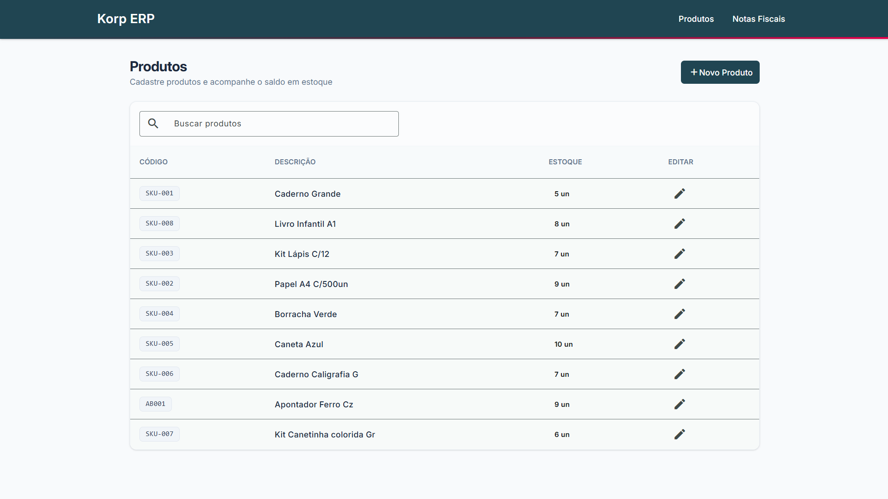
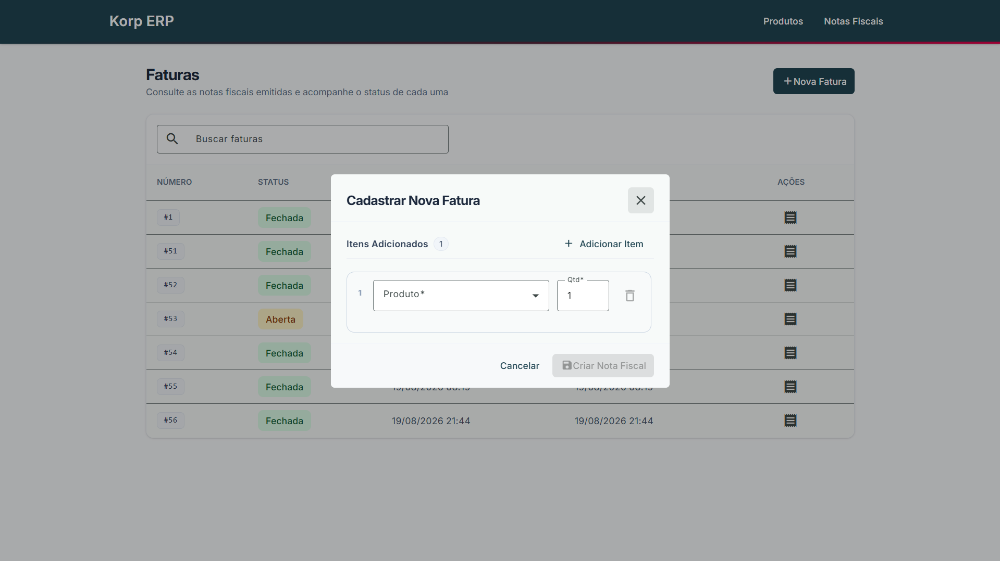
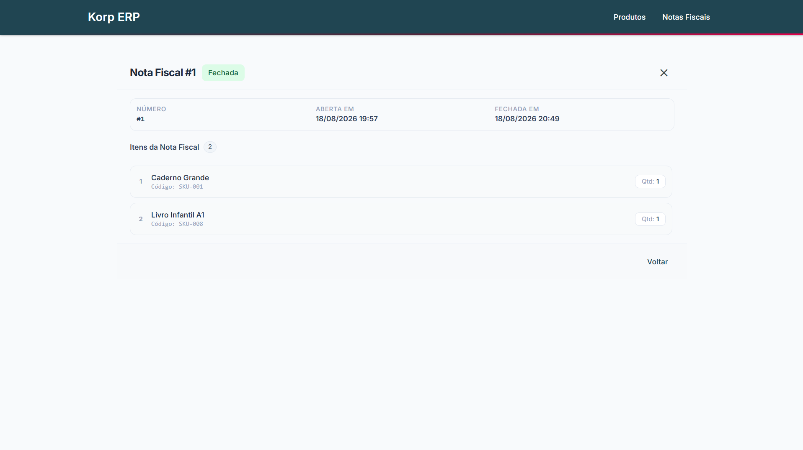

# Korp — Sistema de Emissão de Notas Fiscais

Projeto técnico desenvolvido para o desafio da Korp: cadastro de produtos, criação de notas fiscais com múltiplos itens e um fluxo de fechamento que dá baixa automática no estoque. Construído como dois microsserviços em C#/.NET (Stock Service e Billing Service), cada um com seu próprio banco SQL Server, e um frontend em Angular consumindo os dois.

O detalhamento técnico completo (arquitetura, decisões, tratamento de falhas e como executar o projeto) está em [`docs/09-detalhamento-tecnico`](docs/09-detalhamento-tecnico/DETALHAMENTO-TECNICO.md).

## Telas

**Produtos**

**Nova nota fiscal**

**Detalhe e impressão da nota**

## Documentação

- [Requisitos](docs/01-requisitos/README.md)
- [Arquitetura](docs/02-arquitetura/README.md)
- [Frontend (Angular)](docs/03-frontend-angular/README.md)
- [Backend (C#)](docs/04-backend-csharp/README.md)
- [Banco de dados](docs/05-banco-de-dados/README.md)
- [Integração entre microsserviços](docs/06-integracao-microsservicos/README.md)
- [Falhas e resiliência](docs/07-falhas-e-resiliencia/README.md)
- [Testes](docs/08-testes/README.md)
- [Detalhamento técnico](docs/09-detalhamento-tecnico/DETALHAMENTO-TECNICO.md)
